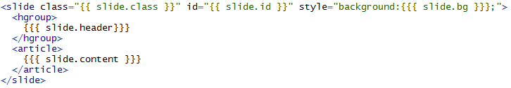
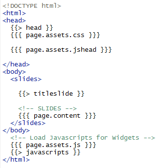

## INTRO 

[`slidify`](http://slidify.org) is an extremly powerful tool to convert any **Rmd** (R markdown) document to a beautiful and custom html5 presentation. 

From Slides to a complete website, many different documents can be rendered changing only a few lines. 

Have a tour into some examples following this link: [slidify examples](http://ramnathv.github.io/slidifyExamples/)

---

## Install slidify 

To install slidify you will need to install in **R** , `slidify` and `slidifyLibraries` packages from github (the *dev* branch).

To do that you need to install `devtools` package to be able to run these commands: 

    require(devtools)
    install_github("slidify","ramnathv","dev")
    install_github("slidifyLibraries","ramnathv","dev")

---

## Run Slidify 

Open a new project in RStudio, or create a new directory where you will have your files.  
Set the working directory in that folder:

    setwd("path/to/folder")

Now run the command **author(**"myname"**)** which will create a directory called "myname": 

    author("myname")

<small> You can download the examples from [slidify examples](http://ramnathv.github.io/slidifyExamples/) to explore the code and get ideas. </small> 

---

## The Beginning  

The file **index.Rmd** will be created and in it you will have the **YAML** configuration, which looks like: 

    ---
    title       : 
    subtitle    : 
    author      : 
    job         : 
    framework   : io2012        # {io2012, html5slides, shower, dzslides, ...}
    highlighter : highlight.js  # {highlight.js, prettify, highlight}
    hitheme     : tomorrow      # 
    widgets     : []            # {mathjax, quiz, bootstrap}
    mode        : selfcontained # {standalone, draft}
    ---


---
## The Beginning   
These first lines are  **YAML** code to configure and pass some information to slidify. 
To begin to write your document you can fill this lines:  

    title : 
    subtitle: 
    author: 
    
To make a slide for you document you can enter this text after that YAML code: 
    
    ## The first Slide Title 
    The slide content 

To create another slide, you only have to write : 

    --- 

as that is the slides "separator". 

--- 
## Basic Slide Structure 

A slide has a **title** and a **content**
They are created by slidify from this markdown code: 

    --- 
    ## side title 
    slide content
    
For example the next slide is created with this code: 

    ---
    ## A slide example 
    This is an example of content. 
    
    1. simple 
    2. short 

go to the next slide to see the result ->

---
## A slide example 
This is an example of content. 

1. simple 
2. short 

--- 
## How does it work? 

The magic of slidify is happening in a few steps. 
In a slidify document (which is an Rmd document) there are 3 main types of code: 


#### Markdown code:

    **bold** , *italics* 
 
 
####  R code: 

    ```{r} 1+1 ``` 


#### "slidify" code : 

    --- .class1 #id3 bg:black
    ## title 
    *** =first 

--- 
## How does it work? 

`slidify` code is parsed by slidify and transformed into html (as markdown and R code are, too). 

To customize slidify, it is important to understand how the code is transformed into html. 

---

## The main structure  

A slidify document is a **page** that contains **slides**

The page corresponds to all the document, and each slide is those pieces separated by **---** 

pages and slides have **elements** that are used to parse the code into html. 

The beginning of our Rmd document (YAML code) is used to assign elements to the page: 

    ---
    author : John TwoLegs
    ...
    ...
    ---

is going to assign the **page element** "author" the value "John TwoLegs".
In general, elements and their values are written as pairs : 
    
    element:value 

---

## The main structure  

slide elements are assigned with this code : 

    --- &layout .class #id element:value
    ## slide header
    
    slide content
    
    *** =blockname
    ---
    
`layout` is the layout (template) used to render the slide.   
`class` is the slide's class for the slide.   
`id` is the slide's id.   
after the "---" if we type `##` the text following that will be the `header` element.    
The text after the header will be the value of the `content` element.    
If we want to specify a `block` in the slide, we do it by typing `*** =blockname`   

It is always possible to use the rule of typing:  `element:value`. 

---
## Parsing code 

`slidify` will read the code we type, defining page and slide elements and assigning the values we typed. 
For example if to make a slide we write this code : 

    --- &simple .dark #end bg:grey 
    ## Custom Slidify 
    To customize ...  
    ---
    
We will tell `slidify` to assing this values to this slide elements: 

element  |  value 
--------- |---------- 
layout  | simple
class | dark
id | end
bg | grey
header | "Custom Slidify"
content | "To customize ..."

--- 

## Layouts 

Once `slidify` finds elements and values, it will use those to make a document. 
To do that, it will need a *skeleton template* to insert into it the values of the elements found. 

Layouts are `.html` files (found in the "layouts" directory).

Here is an example of a simple layout used for a slide (called **simple.html**): 



--- 
## Layouts 

For the example code for a slide : 

    --- &simple .dark #end bg:grey
    ## Custom Slidify 
    To customize ...  
    ---

`slidify` will find the elements of the slide and their values, and parse them into the layout 
(in this case simple.html) generating this html code: 

    <slide class="dark" id="end" style="background:blue;">
    <hgroup>
     Custom slidify 
    </hgroup>
     <article>
      To customize...  
     </article>
    </slide>

--- 
## Layouts 

What `slidify` did is to replace { { slide.element } } by the value of that element. 

For our example slide : 

    --- &simple .dark #end bg:grey
    ## Custom Slidify 
    To customize ...  
    ---

element  |  value | call in layout
--------- |---------- |---------- 
class | dark |  {{ slide.class &#125;&#125; 
id | end | {{  slide.id  &#125;&#125;
bg | grey | {{{ slide.bg  &#125;&#125;&#125;
header | Custom Slidify |  {{{ slide.header  &#125;&#125;&#125;
content | To customize ... | {{{ slide.content  &#125;&#125;&#125;

---
## Layouts

Another way to type the elements and values is 

    --- {class: active, id: problem, bg:black }
   
Elements can have sub-elements. To code them we use : 

    {
     id: showit
     menu: 
     - {item: Home, href: index,  icon: home}
     - {item: "Start", href: start, icon: signin}
    }
    
Here we have the element "menu" that have "item" "href" and "icon" as sub-elements. 
To call them in a layout we will code: 

    {{ # slide.menu } } 
    {{ item } }  {{ href } } {{ icon } } 
    {{ /slide.menu } }
    
That is, to access sub-elements, we can "open" and "close" with  `{{ # } } {{ / } }` and inside it, call the sub-elements with `{{ } }`

--- 
## BLOCKS 

We can define different blocks into the same slide, by typing : 

    *** =blockname 
    
where `blockname` is the name of the block. 

To call the content of that block in a layout, we will code: 

    { { { slide.blockname.html } } }

For example, to have a two-column slide, we can write in this way: 

    --- &twocol 
    ## two columns layout 
    
    *** =left 
    
    this is the left one.  
    
    *** =right 
    
    the right one. 


---
## BLOCKS 

In the layout "towcol.html" we can code : 

    ---
    layout: slide
    ---
    { { { slide.content } } }
      <div style='float:left;width:48%;' class='centered'>
    { { { slide.left.html } } }
    </div>
    <div style='float:right;width:48%;'>
    { { { slide.right.html } } }
    </div>

and that will parse the "left" and "right" block into a html code. 


adding `.html` to `slide.left` is ensuring that the element "left" is parsed as html with header and content (once parsed by markdown and sidify).


---
## THE DECK LAYOUT 

The default layout for the page (for the document) is **deck.html** or **default.html** 
Here is an example of it: 



<small> 
`{ {> head }}` is making that the file `head.html` is imported. This file is in the **partials** directory.   
With `{ {>  javascript }}` and `{ {>  titleslide }}` we are importing the files "javascript.html" and "titleslide.html" from **partials** directory.   
`{ { page.assets.css}}` contains the reference list to the css files in the `assets/css` directory. 
</small> 

---
## ASSETS 

`Slidify` is taking css and layouts from the folder in `frameworks/fname` . Those are the files that come with the framework used.

If we want to customize layouts, partials, and css, we can put them into `assets/layouts`, `assets/partials` , `assets/css` . 

`assets` has priority over the framework files and will override their rules.   
`assets` directory is also the place to include images, etc. 

Calling `{ { page.url.assets }}` in a layout or partial will give the route to the `assets` directory.  


--- &toc

## the toc 
